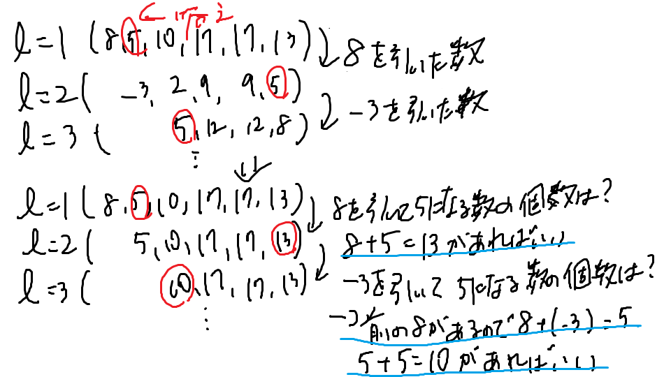

# コンテスト
2021/12/25<br>
[AtCoder Beginner Contest 233](https://atcoder.jp/contests/abc233)

# 記録
## 総合
|  順位  |  パフォーマンス  | レーティング |
| ---- | ---- | ---- |
|  3607 th / 7817  | 581 | 626 → 622 (-4) |

## 提出
|  時間  |  所要時間  |  問題  | 結果 |
| ---- | ---- | ---- | ---- |
| 2021-12-25 22:24:37 |    | C | AC |
| 2021-12-25 22:13:44 |    | C | WA |
| 2021-12-25 21:17:45 |    | B | AC |
| 2021-12-25 21:04:26 |    | A | AC |


# 詳細
## [A問題](https://atcoder.jp/contests/abc233/tasks/abc233_a)
### [提出コード](https://atcoder.jp/contests/abc233/submissions/28115258)
```c++
  int main() {
    int x, y; cin >> x >> y;
    int ans = 0 < (y-x) ? ((y-x)+(10-1)) / 10 : 0;
    cout << ans << endl;
  }
```

### コメント
[解説](https://atcoder.jp/contests/abc233/editorial/3171)


## [B問題](https://atcoder.jp/contests/abc233/tasks/abc233_b)
### [提出コード](https://atcoder.jp/contests/abc233/submissions/28123993)
```c++
  int main() {
    int l, r; cin >> l >> r; --l; --r;
    string s; cin >> s;
    string ans = "";
    rep(i, (int)s.size()){
      if(l <= i && i <= r){
        //i=2 r=6 l=2 6
        //i=3 r=6 l=2 5
        ans += s[r-(i-l)];
        continue;
      }
      ans += s[i];
    }
    cout << ans << endl;
  }
```

### コメント
[解説](https://atcoder.jp/contests/abc233/editorial/3172)

解説はswap


## [C問題](https://atcoder.jp/contests/abc233/tasks/abc233_c)
### [提出コード](https://atcoder.jp/contests/abc233/submissions/28143792)
```c++
  map<ll, ll>c;
 
  void calc(vector<vector<ll>> data, int index, ll n, ll x){
      if((int)data.size() <= index){
        ++c[n];
        return;
      }
      vector<ll>d = data[index];
      for(int j=0; j<(int)d.size();++j){
        if((x / n) < d[j]){
          continue;
        }
        ll tn = n * d[j];
        calc(data, index+1, tn, x);
      }
  }
 
  int main() {
    ll n, x; cin >> n >> x;
    vector<vector<ll>> data(n);
    rep(i,n){
      ll l; cin >> l;
      rep(j, l){
        ll a; cin >> a;
        data[i].push_back(a);
      }
    }
 
  calc(data, 0, 1, x);
 
    cout << c[x] << endl;
  }
```

### コメント
[解説](https://atcoder.jp/contests/abc233/editorial/3162)

初め個数の和が10^5だと思ってて時間くった（計算量的に全探索できないので）

よく問題みたら積だった（＝組み合わせの数）

以下が抜けてて1WA

```c++
        if((x / n) < d[j]){
          continue;
        }
```


## [D問題](https://atcoder.jp/contests/abc233/tasks/abc233_d)
### 提出コード

```c++

```

### コメント

[解説](https://atcoder.jp/contests/abc233/editorial/3163)

* 問題みたときに累積和を使いそうとは思ったけど、使い方がわからなかった

2022/01/08追記

[提出](https://atcoder.jp/contests/abc233/submissions/28378604)

```c++
  int main() {
    //6 5
    ll n, k; cin >> n >> k;
    //8 -3 5 7 0 -4
    vector<ll> a(n);
    rep(i, n) cin >> a[i];
    //0 8 5 10 17 17 13
    vector<ll> s(n+1);
    rep(i, n) s[i+1] = s[i]+a[i];
    //sr-si=k → sr=k+siとなる個数
    map<ll, int> mp;
    ll ans = 0;
    rep(i, n+1){
      //0 mp[0] // r=0のときlを移動して5にできる数は0
      //0 mp[8] // r=1のときlを移動して5にできる数は0
      //1 mp[5] // r=2のときlを移動して5にできる数は1
      //2 mp[10] // r=3のときlを移動して5にできる数は1
      //2 mp[17] // r=4のときlを移動して5にできる数は0
      //2 mp[17] // r=5のときlを移動して5にできる数は0
      //3 mp[13] // r=6のときlを移動して5にできる数は1     
      ans += mp[s[i]];
      //自分のメモ参照
      mp[s[i]+k]++;
    }
    cout << ans << endl;
  }
```

以下の解説を参照

https://zenn.dev/m193h/articles/20211225sat231303m193habc233#d---count-interval

「例1の場合のC」と「例1の場合」の関係メモ



